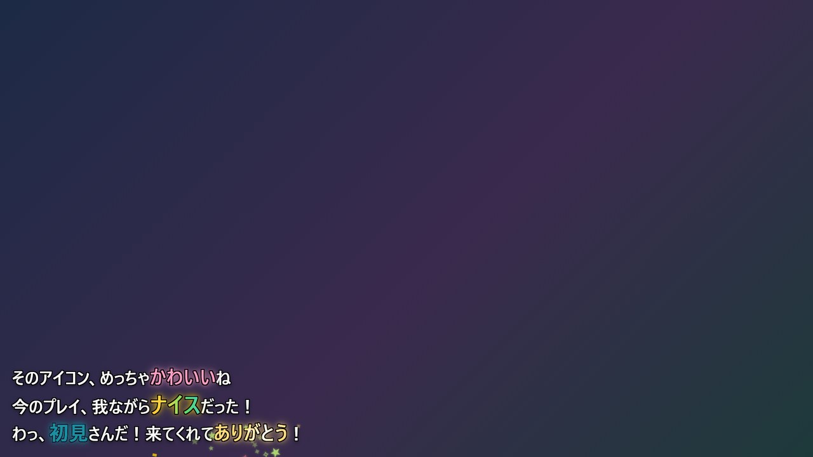
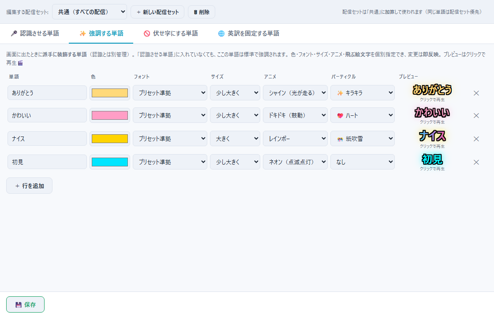

# Mojicast エフェクトガイド（強調する単語）

「ありがとう」と言った瞬間にキラキラが舞う——そんな**単語単位の演出**を作るガイドです。
アニメ13種・パーティクル6種の全カタログと、配信が華やぐ仕込み方のコツをまとめています。

> 🎨 [スタイル・レイアウト作成ガイド](STYLE_GUIDE.md)が「字幕全体の見た目」の話なのに対し、
> こちらは「**特定の単語だけ**を光らせ・動かし・飛ばす」話です。
> ここに書いてある組み合わせも、もちろんあくまで目安。自由に遊んでください。

↑「初見」=ネオン、「かわいい」=ドキドキ、「ナイス」=レインボー、
「ありがとう」=シャイン＋キラキラのパーティクル。全部この画面のように**同時に共存**できます。

## 1. エフェクトの仕組み

- 登録した単語が**確定字幕に出た瞬間**に発動します（認識途中の薄文字では発動しない※）
- 色・フォント・サイズ・アニメ・パーティクルを**単語ごとに個別指定**
- 変更は保存で**即反映**（アプリ再起動不要）。プレビューはクリックで何度でも再生できます
- 「認識させる単語」に登録した固有名詞も、自動で強調されます
  （スタイルの「強調の色」＋ポップ。パーティクルなし）。
  専用の見た目にしたい単語だけ「強調する単語」へ登録すればOK

※ スタイル側の「途中表示にエフェクトを乗せる」をONにすると薄文字でも色・アニメが付きますが、
パーティクルが飛ぶのは確定の瞬間だけです。

## 2. 登録のしかた

コックピットの「🎨 字幕スタジオ」→ 左メニュー「**ワード演出**」（＝単語の「✨ 強調する単語」タブ）。

| 列 | 意味 |
|---|---|
| 単語 | 強調したい言葉。**字幕に出る表記どおり**に書く |
| 色 | 単語の文字色。指定すると**同じ色のグローが自動で付いて光ります** |
| フォント | この単語だけ書体を変える（例: 英単語だけ Impact）。普段は「プリセット準拠」でOK |
| サイズ | 標準 / 少し大きく(×1.15) / 大きく(×1.3) / 特大(×1.5) |
| アニメ | 動き方。下の[カタログ](#3-アニメカタログ13種)から |
| パーティクル | 単語から飛び出す絵文字。下の[カタログ](#4-パーティクルカタログ6種)から |

- エフェクト単語は自動で**最太字**になります。細字スタイルでも埋もれません
- 上部の「編集する配信セット」で**配信セット**（雑談用・ゲーム用・歌枠用…）を分けられます。
  配信セットは「共通」への加算で、同じ単語は配信セット側が優先

> ⚠ 単語のマッチは**表記どおり**です。「有難う」と「ありがとう」は別物なので、
> よく出る表記ゆれは行を分けて両方登録しておくと取りこぼしません。

## 3. アニメカタログ（13種）

**ワンショット**（出た瞬間だけ動く）と**ループ**（表示中ずっと動く）があります。

| アニメ | 動き | タイプ | 向いている単語 |
|---|---|---|---|
| ポップ | ぐんっと拡大して戻る | ワンショット | 汎用。迷ったらこれ |
| バウンス | ぽよんと2回跳ねる | ワンショット | かわいい系・挨拶 |
| スピン | くるっと縦回転して登場 | ワンショット | 決め台詞・技名 |
| フラッシュ | 2回強く光る | ワンショット | 重要ワード・警告系 |
| ネオン | 蛍光灯がチカチカ点灯→ゆっくり明滅 | ループ | サイバー系・店名看板風 |
| レインボー | 6色の虹が流れ続ける | ループ | 最上級のお祝いワード |
| シャイン | 指定色の文字に白い光が走り続ける | ループ | 金色と好相性。感謝・尊さ |
| ウェーブ | 1文字ずつ時差で波打つ | ループ | 歌・楽しい系 |
| ドキドキ | 鼓動のように2拍で脈打つ | ループ | 推し名・好き・かわいい |
| ふわふわ | ゆっくり上下に浮遊 | ループ | ゆるい系・眠い系 |
| グリッチ | 時々ガガッとバグる | ループ | ホラー・電脳系・NGワード風 |
| グロー点滅 | 明るさが脈打つ | ループ | グロー強めスタイルで映える |
| ぷるぷる | 小刻みに震え続ける | ループ | 寒い・怖い・緊張 |

- **ワンショットは何個あっても上品**。発動の瞬間だけ動いて、あとは色付き文字として残ります
- **ループは表示中ずっと動く**ので、行数の多いログ型レイアウトだと画面のあちこちが
  常に動いて騒がしくなりがち。テロップ型（2〜3行ですぐ流れる）なら思い切り使えます
- レインボーを指定した場合、文字は虹色になり「色」の指定はグローとパーティクルに使われます

## 4. パーティクルカタログ（6種）

単語の位置から絵文字が飛び出します。色は「色」欄から自動で彩り（近い色相＋白）が作られます。

| パーティクル | 動き |
|---|---|
| ✨ キラキラ | 星が上へ舞い上がる |
| 🎊 紙吹雪 | 紙片がひらひら舞い落ちる |
| 💖 ハート | ハートが上へふわっと飛ぶ |
| 💥 光の粒 | 全方位に弾ける |
| 🌸 桜吹雪 | 桜の花びらが舞い落ちる |
| 🎵 音符 | 音符が上へ跳ねていく |

- 発動は確定の瞬間に**1回だけ**。約1秒で消える、いい塩梅の主張です
- **字幕を画面最下部に置いている場合、「舞い落ちる」系（紙吹雪・桜）はすぐ画面外へ
  落ちてほぼ見えません**。下部配置なら上へ飛ぶ系（キラキラ・ハート・音符）がおすすめ

## 5. 演出設計のコツ

### 仕込む単語の選び方

エフェクトは「自分がよく言う言葉」に仕込むほど、配信が**勝手に**華やぎます。

- **鉄板枠**: 挨拶（こんばんは）・感謝（ありがとう）・リアクション（すごい、かわいい）
- **推し色枠**: 自分の名前・チャンネル名・ファンネームは、テーマカラー＋パーティクルで特別扱いに
- **ゲーム枠**: ナイス、クリア、勝った、やられた——プロファイルを分けてゲーム別に
- 逆に、**口癖レベルで頻出する言葉**（えっと、なんか）に付けると画面がずっと騒がしくなります

### バランスの取り方

- 1回の発言で光る単語は**1〜2個まで**が心地よい。全部光ると、どれも目立ちません
- パーティクル付きは**とっておきの数語だけ**に。希少だから嬉しい演出です
- 色は「単語の意味」か「スタイルの強調色」のどちらかに寄せると統一感が出ます
  （ありがとう=金、かわいい=ピンク、のように意味と色を揃えると直感的）

### ジャンル別レシピ

| 配信 | 仕込み例 |
|---|---|
| 雑談 | ありがとう=シャイン金＋✨ ／ かわいい=ドキドキピンク＋💖 ／ 初見=ネオン水色 |
| ゲーム | ナイス=レインボー＋🎊 ／ クリア=フラッシュ金＋💥 ／ やられた=グリッチ赤 |
| 歌枠 | 曲名=ふわふわ＋🎵 ／ サビの決めワード=シャイン＋✨ |
| ホラー | 出た=グリッチ＋ぷるぷる ／ こわい=ぷるぷる青白 |
| お祝い・記念 | おめでとう=レインボー＋🎊 ／ 記念日名=シャイン金＋✨ |

## 6. 知っておくと便利なこと

- 「今日は落ち着いた配信にしたい」という日は、コックピット右カラム「字幕に追加する」の
  「**ワード演出**」トグルをオフに。登録を消さずに、表示だけまとめて無効化できます
  （単語の認識誘導・置換・伏せ字はオフでも効いたまま）
- エフェクトはリリックモードでも発動します。歌詞の決めワードに仕込むと歌枠が映えます
- 単語の装飾（縁取り）はスタイル準拠なので、スタイルを変えてもエフェクト単語は馴染みます
- ⚠ **エフェクト単語は mojipack には含まれません**（mojipackはスタイルとレイアウトのみ）。
  単語一式のバックアップは `data\` フォルダのコピーで
