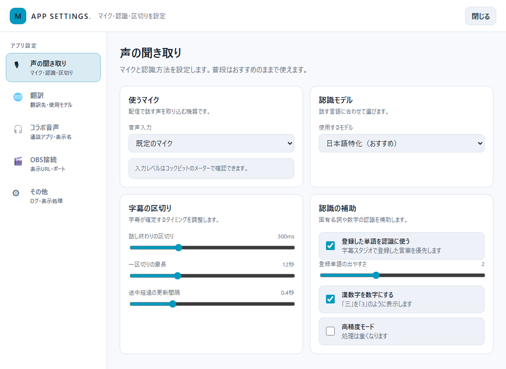

# Mojicast マニュアル

配信用リアルタイム字幕アプリ — 画像つき操作ガイド（v0.5）

> 配布版には同じ内容の `マニュアル.html`（オフラインで読める単一ファイル版・ライト基調）が同梱されています。
> 画像は `tools/manual/shoot.py` → `build_manual.py` で実画面から自動生成しています。

▶ **[30秒デモ動画（YouTube）](https://youtu.be/GObqilowmkU)** — 2人の字幕・翻訳・エフェクトが動く様子
／ テスト協力: [絵咲まくらさん](https://x.com/oftunlab)

## 目次

1. [はじめに・起動方法](#1-はじめに起動方法)
2. [動作環境](#2-動作環境)
3. [コックピット（メイン画面）](#3-コックピットメイン画面)
4. [アプリ設定（声の聞き取り・翻訳・コラボ・接続）](#4-アプリ設定声の聞き取り翻訳コラボ接続)
5. [OBS に字幕を出す](#5-obs-に字幕を出す)
6. [スタジオ（字幕の見た目と言葉）](#6-スタジオ字幕の見た目と言葉)
7. [翻訳の併記](#7-翻訳の併記)
8. [1対1コラボ字幕](#8-1対1コラボ字幕)
9. [フォルダとアップデート](#9-フォルダとアップデート)
10. [困ったときは](#10-困ったときは)

---

## 1. はじめに・起動方法

Mojicast は、マイクの音声をリアルタイムに文字起こしして配信画面に字幕として表示するアプリです。
音声認識（日本語＋多言語）・句読点付け・翻訳（英・中・日・韓・インドネシア）・コラボ相手の字幕化まで、
**すべてお使いのPCの中だけで動きます**。音声がネットに送られることはありません。

**画面はライト基調**です（ヘッダーの 🌙/☀ でダークにも切り替えられます。字幕そのものの色には影響しません）。

**起動手順:**

1. 配布フォルダを**丸ごとローカルディスクにコピー**する（Zip 内や共有ドライブから直接起動しない）
2. `Mojicast.exe` をダブルクリック
3. コックピット画面が開いたら、中央の「はじめの3ステップ」どおりに進める

> **初回のみ**
> - 「WindowsによってPCが保護されました」(SmartScreen) が出たら「詳細情報」→「実行」
> - 初回の ▶開始 時に認識モデル（約1.2GB）を自動ダウンロードします。2回目以降は完全オフラインです
> - OSの言語やCPUに合わせた**おすすめ設定**の提案（`💡 おすすめ設定`バー）が出ることがあります（低スペック機の軽量構成、
>   中国語/英語OSでの多言語認識など）。`この設定にする`か`今のまま使う`かはあなた次第で、あとからいつでも変更できます

> ⚠ **ご利用にあたって**
> 認識・翻訳・伏せ字は完璧ではなく、不適切な表示が出ることがあります（大事な場面はご自身でも確認を）。
> **1対1コラボは相手の声を字幕化・記録する**ので、相手の同意を得てご利用ください。
> 本アプリは無保証（自己責任）です。詳しい免責は README を参照してください。

## 2. 動作環境

| | 目安 |
|---|---|
| OS | Windows 10（2020年以降のアップデート適用）/ Windows 11 |
| PC | **2017年以降の一般的なPC**なら動きます。新しいほど快適 |
| メモリ | 8GB以上（16GB推奨） |
| ストレージ | 空き5GB |
| その他 | マイク / WebView2ランタイム（Win11標準搭載） / 初回のみネット接続（AIの部品を自動ダウンロード） |

難しく考えなくて大丈夫です:

- **初回起動時に、あなたのPCに合わせた「おすすめ設定」をアプリが提案します**（適用するかは自由）
- 使ってみて重いと感じたら → [10章 困ったときは](#10-困ったときは)。ワンクリックで軽くできます
- ゲーム配信と併用する場合、OBSの映像エンコードは「GPU（NVENC/AMF）」がおすすめ。
  MojicastはGPUをほぼ使わないので、ゲームやOBSと取り合いになりません

CPU世代ごとの詳しい適性表・実測データを知りたい方は
**[テクニカルガイド](TECH_GUIDE.md)** へ。

## 3. コックピット（メイン画面）

配信中の司令塔です。**左が字幕モニタ・右が「字幕に足すもの」と「OBS表示」**、こまかい設定は下の
`⚙ アプリ設定` に集約しています。

| 場所 | 内容 |
|---|---|
| ヘッダー | ロゴ・状態表示（停止中/認識中）・テーマ切替（🌙/☀）・`▶ 開始`/`■ 停止` |
| マイクバー | 🎤 マイク選択・入力レベルメーター・`⚙ 聞き取り設定`（→[4章](#4-アプリ設定声の聞き取り翻訳コラボ接続)） |
| 字幕モニタ | 表示内容の確認。`簡易ログ`/`配信プレビュー`を切替（下記） |
| 今日の字幕 | よく使う3つ（字幕デザイン・字幕の位置・配信セット）だけを前面に |
| 右カラム | 「字幕に追加する」トグルと「OBSに表示」 |
| フッター | `🎨 字幕スタジオ`（[6章](#6-スタジオ字幕の見た目と言葉)）・`⚙ アプリ設定`（[4章](#4-アプリ設定声の聞き取り翻訳コラボ接続)） |

### 字幕モニタ（簡易ログ / 配信プレビュー）

モニタ上の切替で表示を選べます。

- **簡易ログ** … 確定した字幕がテキストで流れる軽量表示。話者や処理の確認に
- **配信プレビュー** … OBSに映る字幕を実寸（1920×1080）でそのまま確認できるプレビュー。
  スタイルやレイアウトを変えたときの見え方チェックに便利です

`表示クリア`でモニタとOBSの表示を消せます。

### 今日の字幕｜よく使う3つだけ

配信前にサッと決める3項目です。じっくり作り込むのは `カスタマイズ`（スタジオ）へ。

| 項目 | 内容 |
|---|---|
| 字幕デザイン | 文字スタイルのプリセット切替 |
| 字幕の位置 | レイアウト（表示位置・大きさ・流れ方）の切替 |
| 配信セット | 単語セット（雑談用・ゲーム用など）の切替 |

> 1対1コラボをオンにすると、各行が**「自分」「相手」の2段**になり、別々のデザイン・位置を割り当てられます。

### 字幕に追加する（右カラムのトグル）

確定字幕に「乗せるもの」をトグルで足します。各トグルの `設定` から詳細画面へ飛べます。

| トグル | 説明 |
|---|---|
| ワード演出 | 「ありがとう」などの強調単語の光り・アニメ・パーティクル表示をまとめてオン/オフ。**オフでも認識誘導・置換・伏せ字は有効**。`設定`→スタジオのワード演出 |
| 英訳（翻訳） | 確定字幕の下に翻訳を併記。ラベルは翻訳先に合わせて変わります（英訳/中国語訳/日本語訳など）。`設定`→スタジオの翻訳字幕。翻訳先の切替は[4章 翻訳](#4-アプリ設定声の聞き取り翻訳コラボ接続)／[7章](#7-翻訳の併記) |
| 1対1コラボ | Discord等の相手の声も字幕化。`設定`→アプリ設定のコラボ音声（[8章](#8-1対1コラボ字幕)） |

### OBSに表示

表示用URL（`http://localhost:8765`）の `コピー` と、推奨サイズの案内。`接続設定` でポートを変えられます（[4章 OBS接続](#4-アプリ設定声の聞き取り翻訳コラボ接続)）。

## 4. アプリ設定（声の聞き取り・翻訳・コラボ・接続）

コックピット右下の `⚙ アプリ設定`、マイクバーの `⚙ 聞き取り設定`、各トグルの `設定` から開く**統合設定窓**です。
左のメニューで5つに分かれています。

> 以前あった「AIモデル設定窓」と「1対1コラボ設定窓」は、この**アプリ設定に統合**されました。

### 🎙 声の聞き取り

| 項目 | 説明 |
|---|---|
| 使うマイク | 音声入力デバイスの選択 |
| 認識モデル | **日本語特化（おすすめ）** … 高精度・単語の認識誘導対応 ／ **多言語** … 中・英・日・韓・広東語 |
| 認識する言語 | 多言語モデル選択時のみ。自動判定か言語固定（固定のほうが判定ミスがない） |
| 字幕の区切り | `話し終わりの区切り`（この長さ黙ると1行が確定）／`一区切りの最長`（喋り続けたときの強制確定秒数・**重いPCでは短め推奨**）／`途中経過の更新間隔`（薄文字の更新頻度） |
| 認識の補助 | `登録した単語を認識に使う`／`登録単語の出やすさ`（効かない→上げる/誤爆→下げる）／`漢数字を数字にする`（三十五→35。「一緒」等は変換しない）／`高精度モード`（精度がわずかに上がるが**数倍重い**・通常オフ推奨） |

> **認識モデルの使い分け**: 通常は「日本語特化」のままでOK。「多言語」の出番は
> ①中国語・英語など日本語以外の配信 ②動作を軽くしたいとき、の2つ。
> 多言語モデルでは「認識させる単語」の認識誘導が効かないため、固有名詞の誤変換は
> 読み欄への登録（置換）で直します。日本語の精度は日本語特化のほうが上です。
> 初回選択時にモデル（約240MB）を自動DL。モデルの中身は[テクニカルガイド](TECH_GUIDE.md)へ。

> **反映タイミング**: マイク・認識まわりは**次回 ▶開始 時に反映**されます。認識中に変更すると
> 黄色い警告バー（`⚠ 変更は…「■停止 → ▶開始」で反映されます`）が出るので、コックピットの
> **「今すぐ反映（再起動）」ボタン**を押せばその場で反映できます（停止→開始を自動でやるだけ）。

### 🌐 翻訳

翻訳先の切替と、実際に使われるモデルの表示。詳しくは[7章](#7-翻訳の併記)。

- `翻訳字幕を使う`（コックピットの英訳トグルと連動）
- `字幕を翻訳する言語`: 英語 / 中国語圏（簡体字・中国大陸／繁体字・台湾／繁体字・香港）/ インドネシア語 / 日本語 / 韓国語〔試験的〕
- 選んだ言語に対して**実際に使われる翻訳モデル**（FuguMT / M2M-100 / ＋OpenCC）が表示されます

### 🎧 コラボ音声

1対1コラボの相手音声の取り込み設定。詳しくは[8章](#8-1対1コラボ字幕)。

- `コラボ字幕を使う`（`ヘッドホンを使用してください`）
- `相手の声が鳴るアプリ` … Discord.exe 等を選ぶ（`↻ 更新`／`🔊`＝いま音が鳴っているアプリ）
- 表示名 `自分`/`相手`（字幕ログの話者チップに使われます）

### 🔌 OBS接続

- `表示用URL`（`コピー`）と推奨サイズの案内
- `接続ポート` … 既定 8765。衝突時はここで変更（**次回起動後に反映**・OBS側のURLも更新を）

### ⚙ その他

| 項目 | 説明 |
|---|---|
| 句読点を付ける | 確定文に「、」「。」を自動付与 |
| 字幕ログを保存する | 文字起こしを `logs\` にテキスト保存（[9章](#9-フォルダとアップデート)）。`字幕ログの保存フォルダを開く`ボタンあり |
| 画面テーマ | ライト（既定）／ダーク。**OBSに映る字幕の色には影響しません** |

## 5. OBS に字幕を出す

1. OBS で「ソース追加」→「**ブラウザ**」
2. URL に `http://localhost:8765`（コックピット右カラムの「OBSに表示」からコピー可）
3. 幅・高さを**配信解像度と同じ**に（例: 1920×1080）

話している間は薄い文字で途中経過が出て、ひと呼吸おくと確定文字に変わりエフェクトが発動します。
コックピットの`配信プレビュー`で、貼る前に見え方を確認できます。

## 6. スタジオ（字幕の見た目と言葉）

コックピットの `🎨 字幕スタジオ`、または各項目の `カスタマイズ`/`設定` から開きます。左メニュー「つくるもの」で
**字幕 / 翻訳字幕 / ワード演出 / 保存・共有** に分かれます。右上の「編集する配信セット」は**単語系にだけ効く**プロファイル切替です。

### 💬 字幕（見た目・位置・認識単語）

- **文字スタイル** … フォント・色・フチ・グロー・登場アニメ等。「⧉ 新しいデザイン（複製）」で自分用プリセットを作るのがおすすめ。保存でOBSへ即反映
- **レイアウト** … 表示位置・背景・行数など。`表示のしかた`で **通常（積み上げ・スクロール）／縦書き（右から左へ）／リリックビデオ風字幕** を選べます
- **認識させる言葉** … 固有名詞の誤認識対策（下記の単語タブ）
- コラボ用に「コラボ（小さめ）」スタイルと「左下ハーフ」「右下ハーフ」レイアウトが最初から入っています
- 各項目の意味や読みやすくするコツは **[スタイル・レイアウト作成ガイド](STYLE_GUIDE.md)** に詳しくまとめています

### 📖 単語（4タブ）

| タブ | 役割 |
|---|---|
| 🎤 認識させる単語 | 固有名詞の誤認識対策。「読み／実際に出る形」欄には誤変換の形も入れられ、**「／」区切りで複数並記OK**。次回開始時に反映 |
| ✨ 強調する単語 | 色・アニメ・パーティクルで装飾。保存で即反映 |
| 🚫 伏せ字にする単語 | 出したくない単語を「○○○」に置換 |
| 🌐 英訳を固定する単語 | 人名などの英訳を固定（例: 星野ひかり → Hikari Hoshino）。**日本語→英語（FuguMT）の翻訳時のみ有効** |

上部の「編集する配信セット」で**配信セット（単語プロファイル）**（雑談用・ゲーム用など）を作れます。
配信セットは「共通」への**加算**です（同じ単語は配信セット側が優先）。

強調エフェクトの全カタログ（アニメ13種・パーティクル6種）と演出のコツは
**[エフェクトガイド](EFFECT_GUIDE.md)** にまとめています。

### 🌐 翻訳字幕（見た目・固定訳）

- `翻訳字幕の見た目` … 翻訳字幕のサイズ・濃さ・専用色・専用の縁取り/グローを本文と独立して設定できます
- `訳し方を固定する言葉` … 上記「英訳を固定する単語」（日本語→英語のみ）
- `翻訳の動作設定 ↗` … 翻訳先の切替（アプリ設定の翻訳へ）

### 🔗 保存・共有（mojipack）

- `📤 カスタマイズを書き出す` … 文字スタイルとレイアウトを `.mojipack` ファイルにまとめて配布（`ファイルに保存`／`保存先を開く`）
- `📥 もらったカスタマイズを使う` … 受け取った `.mojipack` を追加（**今ある設定は上書きされません**）

文字スタイル編集画面の下部（`📤 エクスポート`／`📥 インポート`）からも同じ操作ができます。
配り方・もらい方のコツは[スタイルガイド 7章](STYLE_GUIDE.md#7-書き出し取り込みmojipack-みんなで使おう)へ。

## 7. 翻訳の併記

コックピット右カラムの**「英訳（翻訳）」トグルをオン**にすると、確定字幕の下に翻訳が併記されます。
翻訳先は「アプリ設定 → 翻訳」で切り替えられます（コックピットのトグル名も翻訳先に合わせて変わります）。

| 翻訳先 | 使用モデル | 補足 |
|---|---|---|
| 英語（既定） | FuguMT | 「配信→stream」「スパチャ→Super Chat」など配信用語の組み込み辞書つき。人名などは「英訳を固定する単語」で訳を固定できます |
| 中国語（簡体字・中国大陸） | M2M-100 | 「配信→直播」など配信用語に対応。初回選択時に翻訳モデルを自動DL（約470MB） |
| 中国語（繁体字・台湾） | M2M-100 ＋ OpenCC | 簡体字訳を台湾正体字と台湾で一般的な語彙へ変換します |
| 中国語（繁体字・香港） | M2M-100 ＋ OpenCC | 簡体字訳を香港繁体字へ変換します |
| インドネシア語 | M2M-100 | 日本語から直接翻訳します |
| 日本語 | M2M-100 | 多言語認識（中・英・韓）と組み合わせて、**海外の配信を日本語字幕に**する方向 |
| 韓国語 | M2M-100 | **試験的**。翻訳が不安定なことがあります |

- 広東語は繁体字の種類ではなく別の言語です。現在は音声認識のみ対応し、翻訳先としては未対応です
- 認識言語と同じ翻訳先を選ぶと翻訳はスキップされます
- どの翻訳AIがどう選ばれるかの仕組みは[テクニカルガイド](TECH_GUIDE.md)へ

翻訳もローカルで動作（ネット不要・初回DLのみ）。翻訳字幕の見た目（サイズ・色・フチ）は
スタジオの「翻訳字幕の見た目」で本文と独立して調整できます。

> **訳の精度について**: 翻訳はPC内で完結する**軽量なローカルモデル**で動くため、精度は
> クラウド翻訳ほどではなく**「意味が伝わればOK」くらいのそれなり**とお考えください。長い一文や
> 固有名詞・スラングは崩れやすいです。人名・チャンネル名などは「英訳を固定する単語」で訳を固定でき、
> 配信でよく使う語は組み込み辞書で補正しています。気になった誤訳はぜひフィードバックを。

## 8. 1対1コラボ字幕

Discord等で通話しながらのコラボ配信で、**自分と相手の両方の字幕**を別々のスタイル・位置で
表示できます。相手の声は「通話アプリの音」から直接取り込むので、**相手側の準備は一切不要**です
（相手がスマホ・ゲーム機でもOK）。

▶ 実際に動く様子は **[30秒デモ動画（YouTube）](https://youtu.be/GObqilowmkU)** をどうぞ。

| できること | 制約 |
|---|---|
| 相手はアプリ導入・設定不要 | **1対1限定**（3人以上は相手の声がまとまる） |
| 相手の字幕に専用スタイル・位置を割当 | 相手の音は通話品質のため精度は自分よりやや低め |
| 字幕ログに話者名チップ表示 | Windows 10 2004 以降が必要 |

### 設定手順

1. コックピット右カラムの**「1対1コラボ」トグルをオン** → アプリ設定の「コラボ音声」が開く
2. Discord等を起動してから **↻** を押し、「相手の声が鳴るアプリ」で **Discord.exe** などを選ぶ（🔊 = 今音が鳴っているアプリ）
3. 自分と相手の**表示名**を決める
4. コックピットの「今日の字幕」が**自分/相手の2段**になるので、相手の**字幕デザイン・字幕の位置**を選ぶ。
   おすすめは 自分=**右下ハーフ** / 相手=**左下ハーフ**
5. **ヘッドホンを着けて** ▶開始

> ⚠ **ヘッドホン必須**: スピーカーで聞くと相手の声をマイクが拾い、二重に字幕化されます。
>
> **負荷**: コラボ中は認識が2人分になるため、PCによっては重くなります。
> 重い場合は認識モデルを「多言語」にするのが効果的（**2人分でも負荷がほぼ増えません**。精度は少し下がる）。
> 詳しい実測データは[テクニカルガイド](TECH_GUIDE.md)へ。

## 9. フォルダとアップデート

| パス | 内容 |
|---|---|
| `Mojicast.exe` | アプリ本体 |
| `models\` | AIモデル（初回起動時に自動DL） |
| `data\` | 設定・単語帳・スタイル一式。**バックアップはこのフォルダのコピーだけ** |
| `data\profiles\` | 配信セット（雑談用・ゲーム用などの単語プロファイル） |
| `logs\` | 「字幕ログを保存する」オン時の文字起こしと診断ログ |

### 文字起こしログ

アプリ設定の「その他 → 字幕ログを保存する」がオンのとき（既定オン）、配信の文字起こしがテキストで残ります。

- 保存先は `logs\日付\`。**▶開始のたびに1ファイル**（例: `logs\2026-07-20\2026-07-20_161916.log`）
- 各行は `[発言時刻] 本文`。**コラボ中は `[話者名]` も付く**ので誰の発言か分かります
- 確定した字幕のみ記録（薄文字は残らない）。伏せ字は伏せ字のまま
- 発言ごとに書き込むため、アプリが落ちてもそれまでの分は残ります
- 自動削除はされません。古い日付フォルダはそのまま削除してOK
- 活用例: アーカイブ字幕づくり・切り抜きの台本探し・過去の発言の全文検索

**アップデート**: Mojicast終了 → 旧 `_internal` を削除 → 新Zipを同フォルダに上書き展開。
`data\` と `models\` は引き継がれます。追加された新しい既定スタイルは初回起動時に自動で一覧へ追加されます。
アンインストールはフォルダ削除だけ（レジストリ不使用）。

## 10. 困ったときは

| 症状 | 対処 |
|---|---|
| 動作が重い | ① 認識モデルを「多言語」に（負荷が約1/3・精度は少し下がる。アプリ設定→声の聞き取り→認識モデル） ②「高精度モード」オフ ③ 翻訳オフ ④「一区切りの最長」を8秒に。詳しくは[テクニカルガイド](TECH_GUIDE.md) |
| 画面が真っ白 | WebView2 ランタイムをインストール |
| ポート使用中 | 二重起動を解消。別アプリ衝突なら「アプリ設定→OBS接続→接続ポート」で変更 |
| マイクを拾わない | Windowsのマイク許可・他アプリの占有を確認 |
| コラボで相手の字幕が出ない | 通話アプリ起動後に ↻ →選び直し → ■停止→▶開始 |
| コラボで字幕が二重 | ヘッドホンを使う |
| OBSに出ない | URL確認・▶開始しているか・ブラウザソースを再読み込み |
| 「句読点/翻訳の読み込みに失敗」と出る | 字幕本体は動きます。原因が `logs\load_error.log` に残るので報告時に添付を |
| 多言語モデルで固有名詞が直らない | 認識誘導が効かないモデルのため、「認識させる単語」の読み欄に**実際に出た誤変換の形**を登録（「／」区切りで複数OK） |
| 翻訳が出ない | 認識言語と翻訳先が同じだとスキップされます。アプリ設定→翻訳の「使用モデル」表示を確認 |
| 起動しない | ローカルディスクに置く。`ブロック解除.bat` を実行 |

上級者向け: 認識中に `http://localhost:8765/api/perf` で認識処理の回数・平均所要時間(ms)を確認できます。
