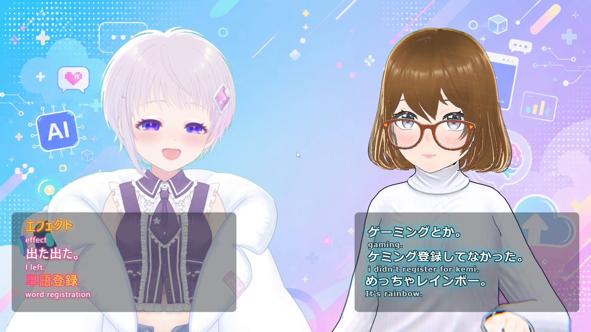
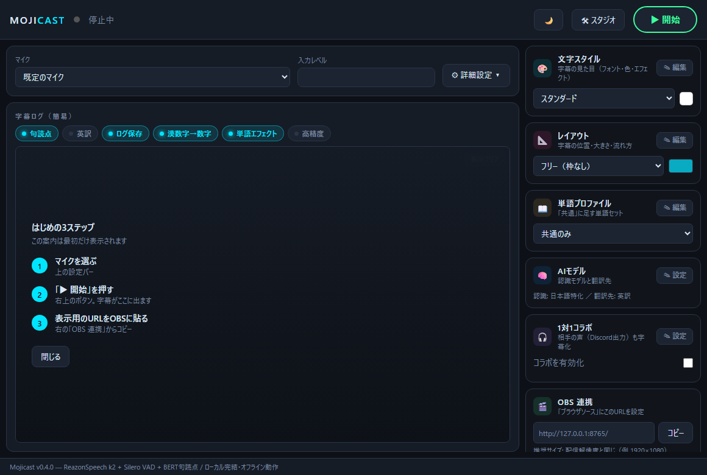
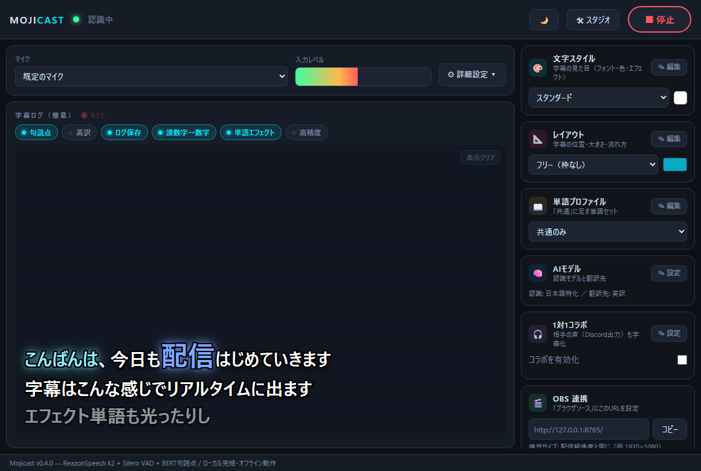
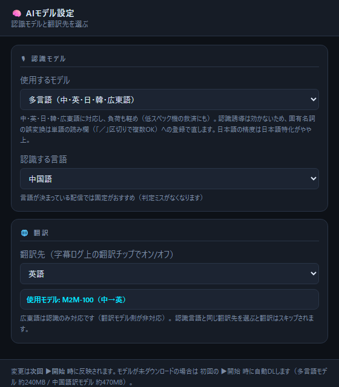
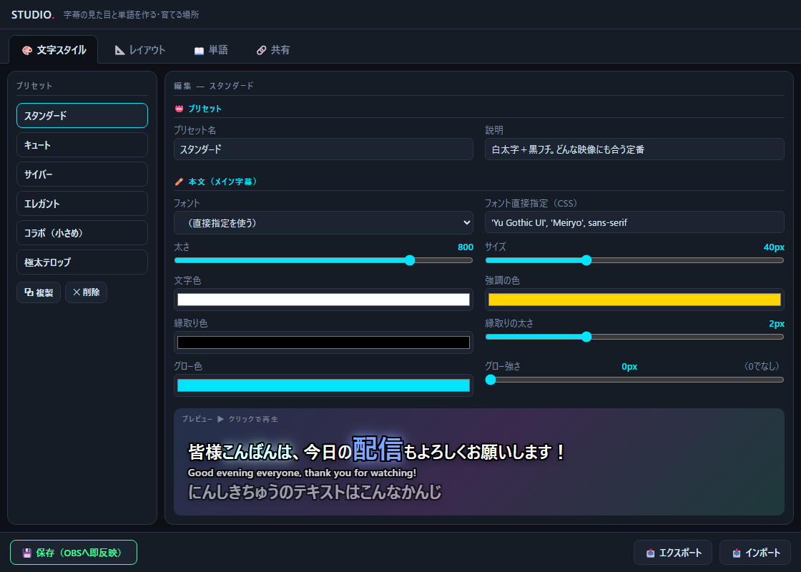
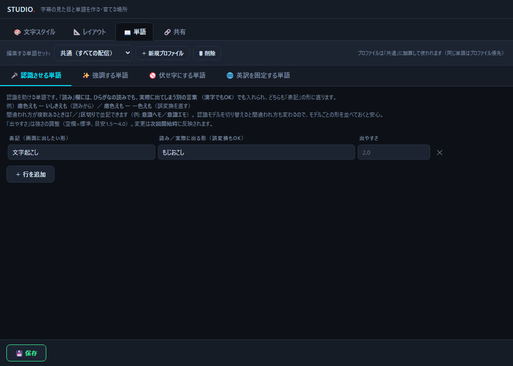
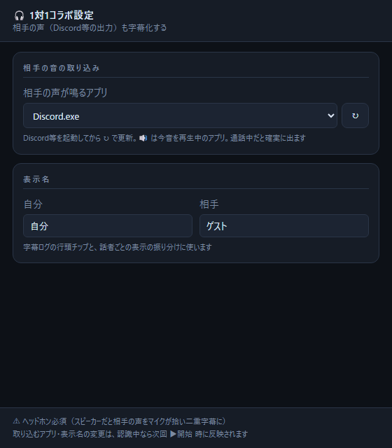
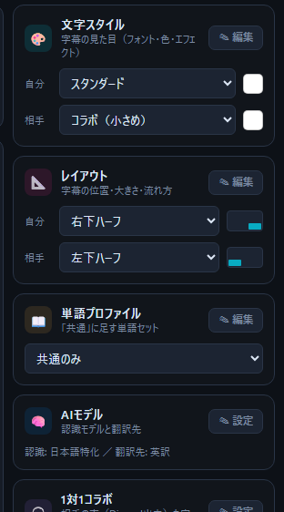
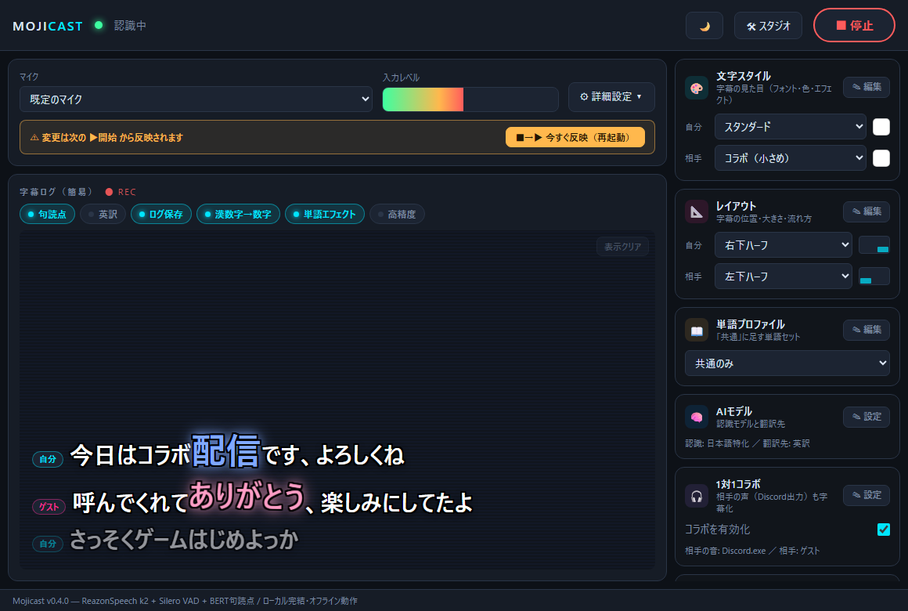

# Mojicast マニュアル

配信用リアルタイム字幕アプリ — 画像つき操作ガイド（v0.4）

> 配布版には同じ内容の `マニュアル.html`（オフラインで読める単一ファイル版）が同梱されています。
> 画像は `tools/manual/shoot.py` → `build_manual.py` で実画面から自動生成しています。

▶ **[30秒デモ動画（YouTube）](https://youtu.be/GObqilowmkU)** — 2人の字幕・翻訳・エフェクトが動く様子
／ テスト協力: [絵咲まくらさん](https://x.com/oftunlab)

## 目次

1. [はじめに・起動方法](#1-はじめに起動方法)
2. [動作環境と CPU の目安](#2-動作環境と-cpu-の目安)
3. [コックピット（メイン画面）](#3-コックピットメイン画面)
4. [OBS に字幕を出す](#4-obs-に字幕を出す)
5. [スタジオ（見た目のカスタマイズと単語登録）](#5-スタジオ見た目のカスタマイズと単語登録)
6. [翻訳の併記（英訳・中国語訳）](#6-翻訳の併記英訳中国語訳)
7. [1対1コラボ字幕](#7-1対1コラボ字幕)
8. [フォルダとアップデート](#8-フォルダとアップデート)
9. [困ったときは](#9-困ったときは)

---

## 1. はじめに・起動方法

Mojicast は、マイクの音声をリアルタイムに文字起こしして配信画面に字幕として表示するアプリです。
音声認識（日本語＋多言語）・句読点付け・翻訳（英・中・日・韓）・コラボ相手の字幕化まで、
**すべてお使いのPCの中だけで動きます**。音声がネットに送られることはありません。

**起動手順:**

1. 配布フォルダを**丸ごとローカルディスクにコピー**する（Zip 内や共有ドライブから直接起動しない）
2. `Mojicast.exe` をダブルクリック
3. コックピット画面が開いたら、案内の3ステップどおりに進める

> **初回のみ**
> - 「WindowsによってPCが保護されました」(SmartScreen) が出たら「詳細情報」→「実行」
> - 初回の ▶開始 時に認識モデル（約1.2GB）を自動ダウンロードします。2回目以降は完全オフラインです
> - OSの言語やCPUに合わせた**おすすめ設定**の提案が出ることがあります（低スペック機の軽量構成、
>   中国語/英語OSでの多言語認識など）。適用するかはあなた次第で、あとからいつでも変更できます

## 2. 動作環境と CPU の目安

| | 最低 | 推奨 |
|---|---|---|
| OS | Windows 10 2004 以降（64bit） | Windows 11 |
| CPU | 4コア8スレッド・AVX2対応 | 下の適性表で ◎〜○ |
| メモリ | 8GB（英訳ON時、本アプリが約2GB使用） | 16GB |
| ストレージ | 空き5GB | SSD |

### CPU の向き・不向き

負荷の本体は音声認識のAI推論（int8）で、**CPUの世代によって速さが数倍違います**。
「コア数」より「世代（対応命令）」が効きます。

| 適性 | CPU の例 | 目安 |
|---|---|---|
| ◎ 快適 | AMD Ryzen 7000 / 9000（Zen 4/5） | 余裕。コラボ・英訳を全部ONでも軽い |
| ○ 実用 | Intel 12〜14世代 / Core Ultra ／ AVX-512対応の Intel 10〜11世代※ | 通常配信は問題なし。コラボで2人とも喋りっぱなしだと負荷高め |
| △ 動くが重め | Intel 8〜10世代（AVX-512非対応モデル） / Ryzen 2000〜5000 | ソロ配信なら実用。[9章](#9-困ったときは)の軽量化設定を推奨 |
| ✕ 非推奨 | AVX2非対応の古いCPU・N100等の省電力CPU | 標準モデルでは連続発話に追いつかず字幕の遅れが溜まります。認識モデルを「多言語」にすると条件付きで動作（下の実測） |

※ **11世代**（デスクトップ Rocket Lake / ノート Tiger Lake）と**10世代ノート**（Ice Lake）は
int8 推論専用命令の **AVX-512 VNNI に対応**しており、見た目の世代より速く動きます
（10世代デスクトップ Comet Lake は非対応なので △）。

この命令を使えるCPU（Zen 4以降・上記のIntel 10〜11世代）は認識処理が数倍速く走ります。
Intel 12世代以降ではAVX-512が無効化され、256bit版の AVX-VNNI に置き換わりました（それでも○）。
CPU使用率は「誰かが喋っている間」だけ上がり、無音の間はほぼゼロです。

> **実測例**（テスター報告・ソロ配信時）:
> - **Intel Core i7-13700HX**（16コア・○の帯）— 認識中のCPU使用率 33〜40%（英訳OFF・通常精度）。
>   英訳ON＋高精度の全部盛りでも 37〜45% と、+5%前後の上乗せで収まる。
>   **認識モデルを「多言語」にすると翻訳ON込みで 13〜20%**（精度と引き換えの軽量モードとしても使える）
> - **Intel N100**（省電力4コア・✕の帯）— 標準モデル（k2）は CPU 90%超に張り付き、連続発話で
>   字幕の遅れが蓄積して実用不可。**認識モデルを「多言語」にすると CPU 80〜90% で概ね追従**
>   （長い文の直後は次の文が遅れるが回復する）。精度と引き換えの低スペック救済ルートとして
>   条件付きで動作。メモリは約1.3GB（ボトルネックはCPU馬力のみ）

#### 世代の見方（自分のCPUがどれか分からないとき）

自分のCPU名は「設定 → システム → バージョン情報」で見られます。

| CPU名の例 | 世代の読み方 |
|---|---|
| Intel Core i9-**11**900 / i5-**10**400 | ハイフンの後ろ、**末尾3桁を除いた数字が世代**（11900→11世代、10400→10世代、8700→8世代） |
| Intel Core i7-**11**65G7（ノート） | 同じく先頭2桁が世代（1165G7→11世代。末尾G7はIce Lake/Tiger Lake系＝AVX-512対応の目印） |
| Intel Core **Ultra** 7 155H | 「Core Ultra」と付けば新世代（12世代以降相当）で ○ |
| AMD Ryzen 7 **7**700X（デスクトップ） | 先頭1桁が数字世代。**7**000/**9**000番台なら ◎ |
| AMD Ryzen 7 78**4**0HS（ノート） | ノート用は中身が混在。**十の位が4以上**（7640/7840/8840等）なら Zen 4 相当で ◎ |

> **配信との同時利用**: OBSの映像エンコードはGPUエンコード（NVENC / AMF）推奨。
> Mojicast はGPUをほぼ使わないため、ゲーム・Live2D・OBSとはCPU/GPUの棲み分けができます。

## 3. コックピット（メイン画面）

| 場所 | 内容 |
|---|---|
| ヘッダー | ▶開始/■停止・テーマ切替（🌙/☀）・🛠 スタジオ |
| 設定バー | マイク選択・入力レベルメーター・⚙詳細設定 |
| 字幕ログ | 表示内容の確認。上のチップで字幕処理のオン/オフ |
| 右カラム | 文字スタイル・レイアウト・単語プロファイル・AIモデル・1対1コラボ・OBS連携 |

### ⚙ 詳細設定

| 項目 | 説明 |
|---|---|
| 無音で文を区切る | この長さ黙ると1行が確定。短いほどテンポ良く、長いほど1行が長い |
| 途中経過の更新間隔 | 話している最中の「薄文字」の更新頻度 |
| 一区切りの最長 | 喋り続けたときの強制確定秒数。**重いPCでは短め（8s）推奨** |
| 登録した単語の出やすさ | 登録単語の効きの強さ。効かない→上げる / 誤爆する→下げる |

### 🧠 AIモデル（認識モデルと翻訳先）

右カラムの「AIモデル」→「✎ 設定」で、認識モデルと翻訳先を選べます
（実際に使われる翻訳モデルと方向も設定窓に表示されます）。

| 項目 | 説明 |
|---|---|
| 認識モデル | 日本語特化（既定・高精度・単語の認識誘導対応）/ 多言語（中・英・日・韓・広東語） |
| 認識する言語 | 多言語モデル選択時のみ。自動判定か言語固定（固定のほうが判定ミスがない） |
| 翻訳先 | 翻訳チップの言語（英語 / 中国語・簡体字 / 日本語 / 韓国語〔試験的〕） |

> **認識モデルの使い分け**: 通常は「日本語特化」のままでOK。「多言語」の出番は
> ①中国語・英語など日本語以外の配信 ②低スペック機で標準モデルが重すぎるときの救済、の2つ。
> 多言語モデルでは「認識させる単語」の認識誘導が効かないため、固有名詞の誤変換は
> 読み欄への登録（置換）で直します。日本語の精度は日本語特化のほうが上です。

詳細設定とマイクは**次回 ▶開始 時に反映**されます。認識中に変更すると黄色い警告バーが出るので、
**「今すぐ反映（再起動）」ボタン**を押せばその場で反映できます（停止→開始を自動でやるだけ）。

### 字幕処理チップ

| チップ | 説明 |
|---|---|
| 句読点 | 確定文に「、」「。」を自動付与 |
| 翻訳（英訳/中国語訳） | 確定字幕の下に翻訳を併記。翻訳先は右カラムの「AIモデル」で切替（[6章](#6-翻訳の併記英訳中国語訳)） |
| ログ保存 | 文字起こしを `logs\` にテキスト保存 |
| 漢数字→数字 | 三十五→35 など（「一緒」「十分」等は変換しない） |
| 単語エフェクト | 強調単語の光り・アニメ・パーティクル表示をまとめてオン/オフ。**オフでも単語の認識誘導・置換・伏せ字はそのまま有効** |
| 高精度 | 精度がわずかに上がるが**数倍重い**。通常はオフ推奨 |

## 4. OBS に字幕を出す

1. OBS で「ソース追加」→「**ブラウザ**」
2. URL に `http://localhost:8765`（コックピット右下からコピー可）
3. 幅・高さを**配信解像度と同じ**に（例: 1920×1080）

話している間は薄い文字で途中経過が出て、ひと呼吸おくと確定文字に変わりエフェクトが発動します。

## 5. スタジオ（見た目のカスタマイズと単語登録）

ヘッダーの「🛠 スタジオ」または各項目の「✎ 編集」から開きます。

### 🎨 文字スタイル / 📐 レイアウト

- フォント・色・フチ・グロー・登場アニメ等を調整。「複製」で自分用プリセットを作るのがおすすめ
- レイアウトは表示位置・背景・行数など。縦書き・「リリック」モードもあり
- コラボ用に「コラボ（小さめ）」スタイルと「左下ハーフ」「右下ハーフ」レイアウトが最初から入っています
- 各項目の意味や読みやすくするコツは **[スタイル・レイアウト作成ガイド](STYLE_GUIDE.md)** に詳しくまとめています

### 📖 単語

| タブ | 役割 |
|---|---|
| 認識させる単語 | 固有名詞の誤認識対策。「読み」欄には誤変換の形も入れられ、**「／」区切りで複数並記OK**（同じ表記で行を分けても同じ扱い）。次回開始時に反映 |
| 強調する単語 | 色・アニメ・パーティクルで装飾。保存で即反映 |
| 伏せ字にする単語 | 出したくない単語を「○○○」に置換 |
| 英訳を固定する単語 | 人名などの英訳を固定（例: 星野ひかり → Hikari Hoshino） |

上部の「編集する単語セット」で**単語プロファイル**（雑談用・ゲーム用など）を作れます。
プロファイルは「共通」への加算です。

強調エフェクトの全カタログ（アニメ13種・パーティクル6種）と演出のコツは
**[エフェクトガイド](EFFECT_GUIDE.md)** にまとめています。

### 🔗 共有（mojipack）

スタイルやレイアウトを `.mojipack` ファイルで配布・取り込みできます（既存定義は上書きされません）。

## 6. 翻訳の併記（英訳・中国語訳）

字幕ログ上の翻訳チップをオンにすると、確定字幕の下に翻訳が併記されます。
翻訳先は右カラムの「AIモデル → ✎ 設定」で切り替えられます（チップ名も英訳⇔中国語訳に変わります）。

| 翻訳先 | モデル | 補足 |
|---|---|---|
| 英語（既定） | FuguMT | 「配信→stream」「スパチャ→Super Chat」など配信用語は組み込み辞書で対応済み。人名などは「英訳を固定する単語」で訳を固定できます |
| 中国語（簡体字） | M2M-100 | 選択後の初回 ▶開始 時にモデルを自動DL（約470MB）。「配信→直播」など配信用語に対応。「英訳を固定する単語」は適用されません |
| 日本語 | M2M-100 | 多言語認識（中・英・韓）と組み合わせて、**海外の配信を日本語字幕に**する方向。認識言語は固定推奨 |
| 韓国語 | M2M-100 | **試験的**。翻訳が不安定なことがあります |

広東語は認識のみ対応です（翻訳モデル側が非対応）。認識言語と同じ翻訳先を選ぶと翻訳はスキップされます。

どちらもローカルで動作（ネット不要・初回DLのみ）。翻訳の見た目（サイズ・色・フチ）は
文字スタイルの「英訳」設定がそのまま使われます（中国語訳も同じ）。

## 7. 1対1コラボ字幕

Discord等で通話しながらのコラボ配信で、**自分と相手の両方の字幕**を別々のスタイル・位置で
表示できます。相手の声は「通話アプリの音」から直接取り込むので、**相手側の準備は一切不要**です
（相手がスマホ・ゲーム機でもOK）。

▶ 実際に動く様子は **[30秒デモ動画（YouTube）](https://youtu.be/GObqilowmkU)** をどうぞ。

| できること | 制約 |
|---|---|
| 相手はアプリ導入・設定不要 | **1対1限定**（3人以上は相手の声がまとまる） |
| 相手の字幕に専用スタイル・位置を割当 | 相手の音は通話品質のため精度は自分よりやや低め |
| 字幕ログに話者名チップ表示 | Windows 10 2004 以降が必要 |

### 設定手順

1. 右カラムの「1対1コラボ」で**「コラボを有効化」にチェック** → 設定窓が自動で開く
2. Discord等を起動してから **↻** を押し、「相手の声が鳴るアプリ」で **Discord.exe** などを選ぶ（🔊 = 今音が鳴っているアプリ）
3. 自分と相手の**表示名**を決める
4. コックピットの「文字スタイル」「レイアウト」の**「相手」の行**で相手の見た目を選ぶ。
   おすすめは 自分=**右下ハーフ** / 相手=**左下ハーフ**
5. **ヘッドホンを着けて** ▶開始

| コラボ設定窓 | 自分/相手の見た目割当 |
|---|---|
|  |  |

> ⚠ **ヘッドホン必須**: スピーカーで聞くと相手の声をマイクが拾い、二重に字幕化されます。
>
> **負荷**: コラボ中は認識が2人分になるため最大で約2倍。[2章](#2-動作環境と-cpu-の目安)で ○ 以上を推奨。
> 重い場合は認識モデルを「多言語」にするのも有効（**2人分でも負荷がほぼ増えないことを実測確認**。精度は少し下がる）。

## 8. フォルダとアップデート

| パス | 内容 |
|---|---|
| `Mojicast.exe` | アプリ本体 |
| `models\` | AIモデル（初回起動時に自動DL） |
| `data\` | 設定・単語帳・スタイル一式。**バックアップはこのフォルダのコピーだけ** |
| `logs\` | 「ログ保存」オン時の文字起こしと診断ログ |

### 文字起こしログ

「ログ保存」チップがオンのとき（既定オン）、配信の文字起こしがテキストで残ります。

- 保存先は `logs\日付\`。**▶開始のたびに1ファイル**（例: `logs\2026-07-20\2026-07-20_161916.log`）
- 各行は `[発言時刻] 本文`。**コラボ中は `[話者名]` も付く**ので誰の発言か分かります
- 確定した字幕のみ記録（薄文字は残らない）。伏せ字は伏せ字のまま
- 発言ごとに書き込むため、アプリが落ちてもそれまでの分は残ります
- 自動削除はされません。古い日付フォルダはそのまま削除してOK
- 活用例: アーカイブ字幕づくり・切り抜きの台本探し・過去の発言の全文検索

**アップデート**: Mojicast終了 → 旧 `_internal` を削除 → 新Zipを同フォルダに上書き展開。
`data\` と `models\` は引き継がれます。アンインストールはフォルダ削除だけ（レジストリ不使用）。

## 9. 困ったときは

| 症状 | 対処 |
|---|---|
| 動作が重い | ①「高精度」オフ（効果大） ②「英訳」オフ ③「一区切りの最長」を8秒に ④ [CPU適性](#2-動作環境と-cpu-の目安)を確認 |
| 画面が真っ白 | WebView2 ランタイムをインストール |
| ポート使用中 | 二重起動を解消。別アプリ衝突なら「OBS連携→ポート」で変更 |
| マイクを拾わない | Windowsのマイク許可・他アプリの占有を確認 |
| コラボで相手の字幕が出ない | 通話アプリ起動後に ↻ →選び直し → ■停止→▶開始 |
| コラボで字幕が二重 | ヘッドホンを使う |
| OBSに出ない | URL確認・▶開始しているか・ブラウザソースを再読み込み |
| 「句読点/翻訳の読み込みに失敗」と出る | 字幕本体は動きます。原因が `logs\load_error.log` に残るので報告時に添付を |
| 多言語モデルで固有名詞が直らない | 認識誘導が効かないモデルのため、「認識させる単語」の読み欄に**実際に出た誤変換の形**を登録（「／」区切りで複数OK） |
| 翻訳が出ない | 認識言語と翻訳先が同じだとスキップされます。AIモデル設定窓の「使用モデル」表示を確認 |
| 起動しない | ローカルディスクに置く。`ブロック解除.bat` を実行 |

上級者向け: 認識中に `http://localhost:8765/api/perf` で認識処理の回数・平均所要時間(ms)を確認できます。
