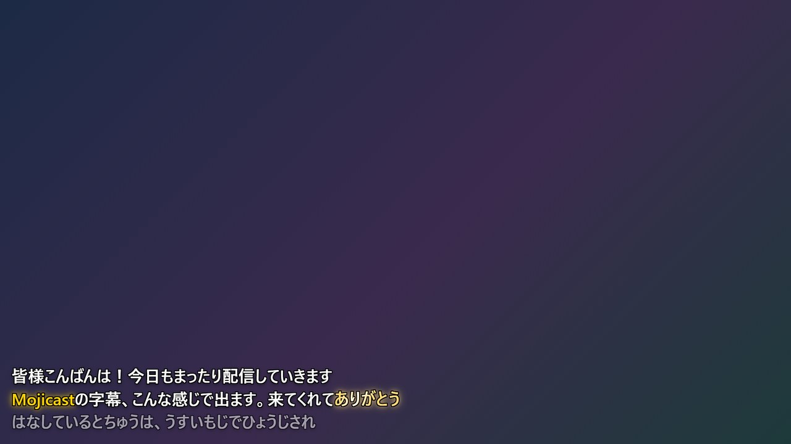
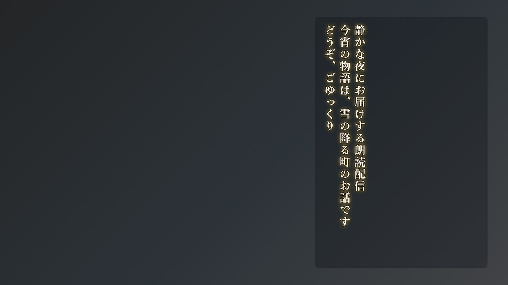
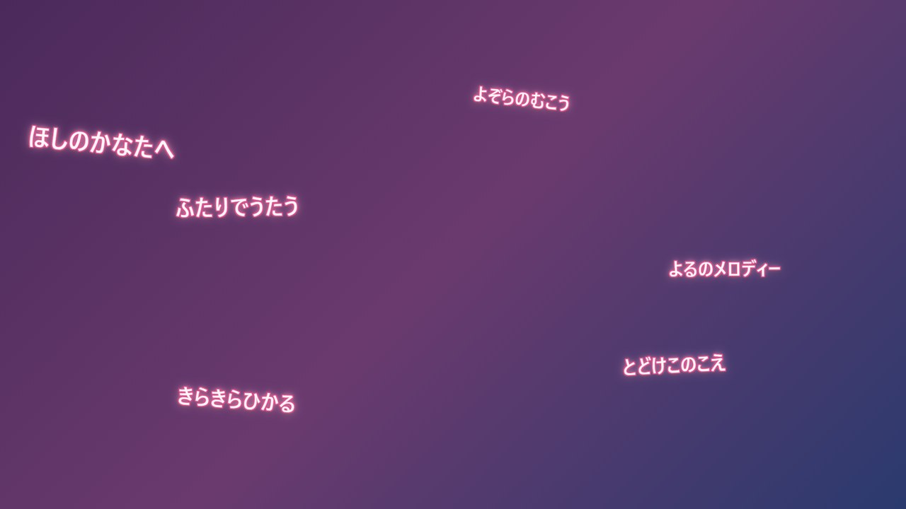
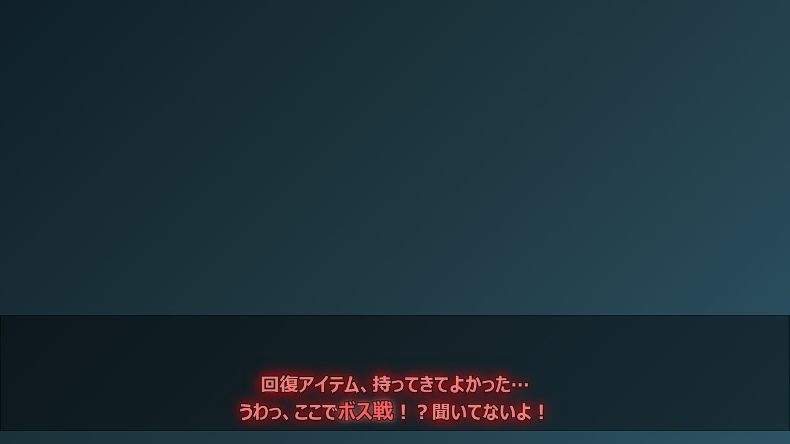
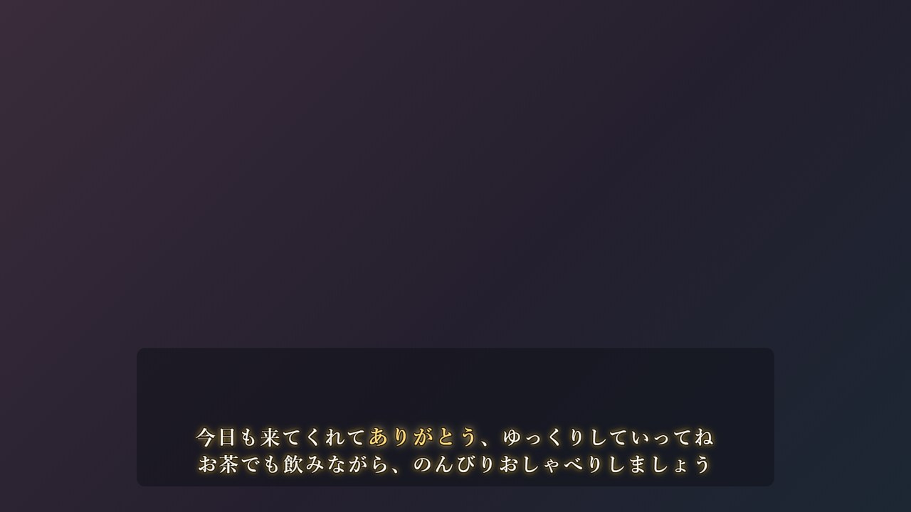
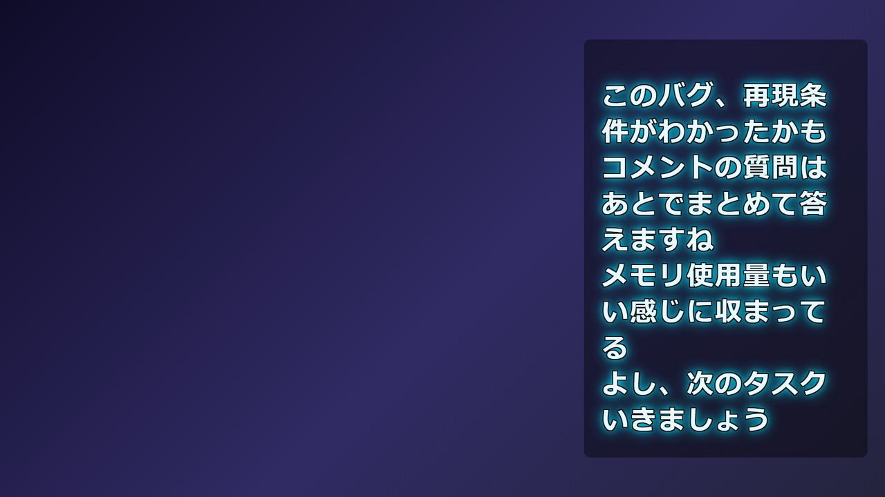
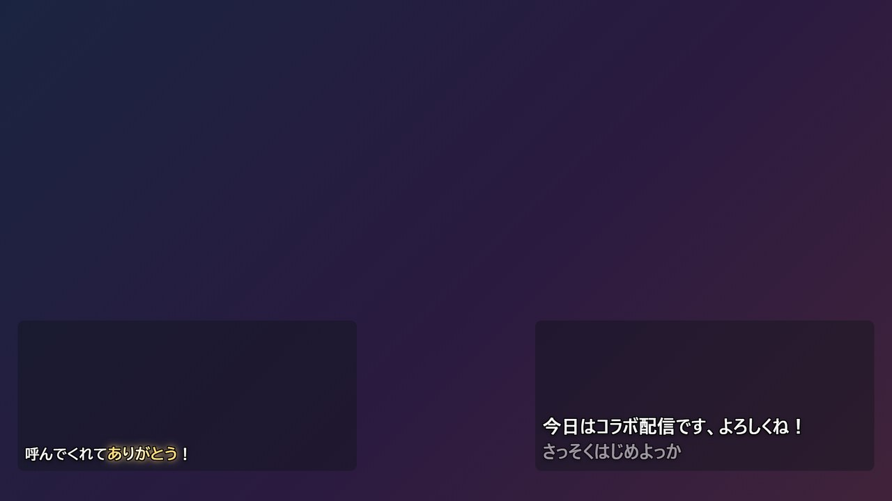

# Mojicast スタイル・レイアウト作成ガイド

自分だけの字幕デザインを作るためのガイドです。スタジオの各項目の意味と、
「読みやすくてかわいい/かっこいい」字幕にするためのコツをまとめています。

> 🎨 **このガイドはあくまで「目安」です。**
> 書いてある数値やセオリーは「迷ったときに戻ってくる場所」であって、守るべきルールではありません。
> セオリーをあえて外したところにあなたの配信だけの個性が生まれます。
> 「読みやすさの3原則」だけ頭の片隅に置いて、あとは自由に遊んでください。

作ったスタイルは `.mojipack` ファイルで書き出して共有できます。
**良いのができたらみんなで使いましょう**（[7章](#7-書き出し取り込みmojipack-みんなで使おう)）。

## 1. まず仕組みを知る

字幕の見た目は **2つの独立したパーツ** の組み合わせで決まります。

| パーツ | 決めるもの | 例 |
|---|---|---|
| 🎨 **文字スタイル** | 文字そのもの（フォント・色・フチ・グロー・登場アニメ） | スタンダード、キュート |
| 📐 **レイアウト** | 文字を置く場所（位置・大きさ・背景・行数・表示モード） | 下部バー、角丸カード |

「サイバー × 下部バー」「キュート × 角丸カード」のように自由に組み合わせられるので、
**スタイルとレイアウトは別々に作る**のが基本です。

これが基本形「スタンダード × フリー」。画面に見えている
**確定字幕（白）・強調単語（黄色）・認識途中の薄文字**が字幕の3要素で、
このガイドで調整していくのはこれらの見た目です。

編集はヘッダーの「🛠 スタジオ」→「🎨 文字スタイル」「📐 レイアウト」タブから。

## 2. 作成の流れ（おすすめ手順）

1. **雰囲気が近い既存プリセットを選んで「⧉ 複製」** — ゼロから作るより断然ラク
2. 名前と説明を付ける（mojipack配布時にそのまま見えるので分かりやすく）
3. パラメータをいじる → プレビューで即確認（プレビューをクリックすると登場アニメを再生）
4. 「💾 保存」— OBSに即反映されるので、**実際の配信画面に重ねて最終確認**
5. 気に入ったら「📤 エクスポート」でバックアップ or 配布

> 💡 レイアウトのプレビューは「＋ 行を追加」でスクロールの動きも確認できます。
> プレビューに使われる文字スタイルは**コックピットで使用中のもの**なので、
> セットで使う予定のスタイルを先に選んでおくと本番に近い見え方になります。

## 3. 文字スタイルの項目とコツ

### 本文（メイン字幕）

| 項目 | 効果 | コツ |
|---|---|---|
| フォント | 文字の書体 | 迷ったら「おすすめ」から。小さめ字幕は **BIZ UDゴシック**（UD=読みやすさ特化）が鉄板 |
| 太さ | 400〜900 | 配信字幕は **700以上**が基本。細字は背景に溶けます |
| サイズ | 20〜80px | 1920×1080基準。フルHDで**36〜46px**が標準、サイドログ等の常時表示は30px前後 |
| 文字色 | 本文の色 | **白 or ごく薄い色**が最強。濃い色を使うならフチを太めに |
| 強調の色 | 「強調する単語」の色 | 本文色と**しっかり差**をつける（白本文なら黄・ピンク・水色など） |
| 縁取り色 / 太さ | 文字のフチ | **読みやすさの生命線**。黒フチ2pxでどんな背景でも読める。0にするのは背景ありレイアウトとセットのときだけ |
| グロー色 / 強さ | 文字の発光 | 0でオフ。**8前後=上品な光沢、16以上=ネオン**。色はフォント色より彩度高めに |
| 登場アニメ | 確定時の動き | 落ち着き系=フェード/スライド、にぎやか系=ポップ/バウンス、演出系=タイプライター |
| 影をつける | ドロップシャドウ | グローなしのとき立体感が出る。グローと併用すると濁ることも |
| 字間 | 文字の間隔 | **明朝体は0.05〜0.08空ける**と高級感UP。ゴシックは0〜0.02で十分 |

> 💡 行全体の「登場アニメ」に対して、**特定の単語だけ**を光らせたりパーティクルを飛ばしたりするのが
> エフェクト単語です。そちらは **[エフェクトガイド](EFFECT_GUIDE.md)** にまとめています。

### 📏 サイズ・色・フチ・グローをもっと詳しく

上の表の要点を、項目ごとに掘り下げます。カッコ内は参考にできる同梱プリセットです。

#### フォントサイズ

サイズは **1920×1080の画面に対するピクセル数**です（OBSのブラウザソースをこの解像度にする前提）。

| 用途 | 目安 |
|---|---|
| 下部テロップ・メイン字幕（しっかり読ませる） | 36〜46px |
| サイドログ・コラボなど常時表示（控えめに） | 26〜32px |
| リリックモード | 本体は40px前後のまま、レイアウト側の「サイズ倍率」で調整 |

- **視聴者の多くはスマホ**です。作業モニタで「ちょっと大きいかな」と感じるくらいが、スマホではちょうど良いことが多い
- サイズを変えたらレイアウトも見直しを。大きくすると1行に入る文字数が減り、折り返しが増えます

#### 文字色

- 基本は白 `#ffffff`。ほんの少し色を混ぜた「ほぼ白」にすると雰囲気が出ます
  （キュートの桜色がかった白 `#fff6fa`、エレガントのクリーム `#fdf8ec`）
- 真っ赤・真っ青など**彩度の高い色を本文にすると長時間は目が疲れます**。
  色で個性を出したいときは、本文は白系のままフチ・グロー側に色を持たせるのがセオリー
- 濃い色の本文にするなら「白フチ」＋「背景ありレイアウト」とセットで

#### 強調の色

「強調する単語」「認識させる単語」が光る色です。

- 本文色と**明るさと色味の両方に差**をつける。白本文なら黄 `#ffd400`・ピンク・水色が三大定番
- 迷ったら**自分のテーマカラー**に。字幕がそのまま推し色演出になります

#### 縁取り（フチ）

文字の輪郭に色を重ねる、**視認性の主役**です。太さ1〜6px。

- **2pxが標準**。どんな背景の上でも読めるようになる保険です
- 小さめの文字（30px以下）でフチを太くしすぎると文字が潰れるので2pxまでに
- 色は真っ黒だけでなく、**テーマに合わせた濃色**にすると印象が柔らかくなります
  （エレガントはこげ茶 `#2a2016`、キュートは濃ピンク `#d94f8c` ＝「本文よりずっと濃い同系色」パターン）
- フチ0pxにして成立するのは、背景の濃さを上げたボックスの中だけ

#### グロー

文字の周りににじむ光。指定サイズと、その2倍のぼかしの2層で光ります。0でオフ。

| 強さ | 印象 | 例 |
|---|---|---|
| 6〜10 | 上品な光沢 | エレガントの金 8 |
| 12〜18 | しっかりネオン | サイバーの水色 16 |
| 20以上 | バラエティ番組の飽和演出 | 極太テロップの赤 22 |

- グロー色は文字色より**彩度高め・少し濃いめ**が光って見えるコツ。
  文字色と同じ色にすると、ただ白っぽくぼやけます（サイバー: 文字 `#e8faff` × グロー `#00e5ff`）
- 強いグローと太い黒フチは喧嘩します。ネオン系はフチ2px以下＋フチ色もほぼ黒の暗色に
  （サイバーのフチ `#001018`）

#### 影

文字の下に落ちるドロップシャドウ（オン/オフのみ）。

- グローなしのスタイルで立体感と視認性が少し上がる、地味に効く一手
- **グロー強めのときはオフ推奨**。光と影が混ざってにごります（サイバーが影オフなのはこのため）

#### 配色の「型」早見表

同梱プリセットは、そのまま配色の型として流用できます。

| 型 | 文字色 / フチ / グロー | プリセット |
|---|---|---|
| 定番・堅実 | 白 / 黒2px / なし | スタンダード |
| ネオン | ほぼ白 / 暗色2px / ビビッド強め | サイバー |
| 上品 | クリーム / こげ茶2px / 金 弱め | エレガント |
| ガーリー | ほぼ白 / 濃ピンク2px / 淡ピンク中 | キュート |
| バラエティ | 淡色 / 黒2px / 同系色 強 | 極太テロップ |

「型」を1つ選んで、色相だけ自分のテーマカラーへ回すのが一番失敗しない作り方です。

### 途中表示（薄文字）

話している最中に出る認識途中のテキストです。

- **濃さ 0.45〜0.6** が目安。薄すぎると「反応してない？」と不安になり、濃すぎると確定字幕と区別がつかない
- 「エフェクトを乗せる」は通常オフ推奨。途中テキストは頻繁に書き換わるのでプレーンな方が目が疲れません

### 英訳（英訳を表示オンのとき）

- サイズは本文比 **×0.5〜0.65**、濃さ0.8前後が読みやすい定番
- 英字は **Impact** や欧文フォントに変えると引き締まる
- 本文が派手なスタイルなら「専用の縁取り・グロー」で英訳だけ控えめにするのもアリ

## 4. レイアウト（ボックス）の項目とコツ

### 位置とサイズ

X/Y/幅/高さはすべて**画面に対する%**（1920×1080想定）。

| 項目 | コツ |
|---|---|
| 位置 | 画面端ギリギリは配信サイトのUI（コメント・シークバー等）と被りがち。**上下左右2〜4%は空ける** |
| 幅・高さ | 高さは「フォントサイズ×行数×1.5倍」くらいが目安。足りないと文字が見切れます |
| 立ち絵・顔カメラ | **自分の立ち絵と被らない位置**が最優先。迷ったら下段中央か逆サイド |

### 背景と装飾

| 項目 | コツ |
|---|---|
| 背景の濃さ | フチだけで読める背景なら0でOK。**ゲーム画面など忙しい映像の上は0.4〜0.6**の半透明黒が効く |
| 角丸 | 0=ニュース風のカッチリ、14〜20=今どきの柔らかい印象 |
| 内側余白 | 背景を付けるなら**14px以上**。文字が縁に張り付くと窮屈に見えます |
| 枠線 | 基本0でOK。アクセントカラー1〜2pxで「カード感」を出せる |

### 表示モードの使い分け

| モード | 向いている用途 |
|---|---|
| **通常（積み上げ）** | 雑談・ゲームなどほぼすべての配信。行数2〜4=テロップ風、10以上=ログ風 |
| **縦書き** | 和風・ホラー・句会など雰囲気重視の配信 |
| **リリックビデオ風字幕** | 雑談をMV風に見せるおまけ演出。確定した発言ごとに構図と動きが変わります |

| 縦書き（エレガント） | リリック（キュート） |
|---|---|
|  |  |

通常モードの補足:

- **保持する行数**: テロップ風なら2〜3行。多くすると過去ログが残り続けます
- **スクロール速度**: 250ms前後が自然。テンポの速いトークなら150msでキビキビと

リリックビデオ風字幕の補足:

- 基本は「おまかせ」でOK。文章の長さや区切りを見て、似合う演出が自動で選ばれます
- 「おとなしい」はフォーカス・誌面・文字送り中心、「にぎやか」は帯・残像・グリッチなども出やすくなります
- **重ねる字幕数は2文**がおすすめ。3文は華やかですが、雑談のテンポが速いと文字が混み合います
- 強い演出は連続せず、同じ演出も続かないよう自動調整されます

## 5. 読みやすさの3原則

デザインで迷ったらここに立ち返ってください。

1. **コントラスト** — 「文字色 vs フチ色」の明暗差がすべて。白文字+黒フチが最強なのはこのため。
   逆パターン（黒文字+白フチ）も可。**中間色同士の組み合わせだけは避ける**
2. **サイズと情報量はトレードオフ** — 大きい文字は目立つが行数が入らない。
   「一番よく話す長さのセリフ」がプレビューで2行以内に収まるかで判断
3. **動きは1か所だけ** — 登場アニメを派手にしたら強調エフェクトは控えめに、など。
   全部盛りは視聴者の目が疲れます

## 6. シーン別レシピ

複製元と変更ポイントの早見表です。**そのまま使うより「出発点」に**。
レシピ通りに作ってから1〜2か所だけ自分の色に変えると、手早くオリジナルになります。

| 作りたいもの | ベース | 変更ポイント |
|---|---|---|
| ゲーム実況の実況テロップ | 極太テロップ × 下部バー | 背景の濃さ0.5、行数2、アニメ=ポップ |
| 落ち着いた雑談 | エレガント × 角丸カード | サイズ38px、グロー6、アニメ=フェード |
| テック系・レトロゲー | サイバー × サイドログ | 行数を増やしてログ風に。MS ゴシックにするとレトロ度UP |
| 歌枠 | キュート × フリー（リリックモード） | 分割=フレーズ、表示時間8秒、縦書き率20% |
| コラボ配信 | コラボ（小さめ）× 左下/右下ハーフ | 自分と相手で**文字色 or フチ色だけ変える**と、統一感を保ったまま見分けられます |

実際に組み合わせるとこうなります（歌枠は[4章](#4-レイアウトボックスの項目とコツ)のリリック例を参照）。

| ゲーム実況テロップ（極太テロップ × 下部バー） | 落ち着いた雑談（エレガント × 角丸カード） |
|---|---|
|  |  |

| テック系ログ風（サイバー × サイドログ） | コラボ（左下/右下ハーフ） |
|---|---|
|  |  |

## 7. 書き出し・取り込み（mojipack）— みんなで使おう

自作のスタイル・レイアウトは `.mojipack` という小さなファイル（中身はテキスト）で
やり取りできます。**良いのができたら、フォロワーさんや配信者仲間に配ってみてくださいね**。
「デザインは苦手…」という人は、誰かのmojipackをもらうところから始めるのが近道です。

### 書き出す（エクスポート）

1. スタジオ下部の「📤 エクスポート」を押す
2. 書き出す範囲を選ぶ:

   | ボタン | 内容 | 使いどころ |
   |---|---|---|
   | 表示中のスタイル | 今編集中の文字スタイル1つ | 自信作を1つだけ配る |
   | 表示中のボックス | 今編集中のレイアウト1つ | レイアウトだけ配る |
   | すべて | 文字スタイル＋レイアウト全部 | 丸ごとバックアップ・引っ越し |

3. `data\export\` に `style_日付_時刻.mojipack` が保存される（「📂 保存先フォルダを開く」ですぐ開けます）
4. ファイル名は**自由にリネームOK**。`ゆるふわ雑談セット.mojipack` のように
   中身が分かる名前にして、Discord や X などで配りましょう

> 💡 エクスポートを押した時点の**未保存の編集も含めて**書き出されます（内部で自動保存されます）。

### 取り込む（インポート）

1. もらった `.mojipack` ファイルを PC の分かる場所に置く
2. スタジオ下部の「📥 インポート」→ ファイルを選ぶ
3. 取り込んだスタイル・レイアウトが一覧の末尾に追加され、**OBSにも即反映**されます

取り込みは安全設計なので、気軽に試して大丈夫です:

- **既存の定義は絶対に上書きされません**（追記されるだけ）
- 同じ名前があった場合は「〜 (imported)」という名前で入ります
- 気に入らなければ選んで「✕ 削除」するだけ
- 取り込んだものを複製して改造するのも自由。**良い改造ができたらまた共有**、で輪が広がります

### 配るときのコツ

- **名前と説明が「商品説明」**。「〇〇風・ゲーム配信向け・下部バーと一緒に推奨」など、
  用途と組み合わせまで書いてあると使ってもらいやすい
- スタイルとレイアウトをセットで設計したなら**両方入れて配布**（「すべて」で書き出すか、個別に2回）
- ⚠ **フォントはmojipackに含まれません**。相手のPCにないフォントは代替表示になります。
  配布用は Windows 標準（游ゴシック・メイリオ・BIZ UD・游明朝）や「おすすめ」内のフォント推奨。
  特殊フォントを使う場合は説明にフォント名と入手先を書いておきましょう
- 配布前に一度**自分で取り込み直して**見た目を確認すると安心（(imported) として入るので確認後に削除）

## 8. よくあるつまずき

| 症状 | 原因と対処 |
|---|---|
| OBSで文字がぼやける/小さい | ブラウザソースの幅・高さが配信解像度と不一致。**1920×1080に合わせる** |
| 文字が見切れる | ボックスの高さ不足。高さを増やすかフォントサイズ/行数を減らす |
| 背景によって読めない場面がある | フチを+1px、または背景の濃さを0.4以上に |
| 配布したら見た目が違うと言われた | フォントが相手の環境にない（[7章](#7-書き出し取り込みmojipack-みんなで使おう)） |
| プレビューと本番で大きさが違う | プレビューは縮小表示。判断は**OBS上での見え方**を基準に |
